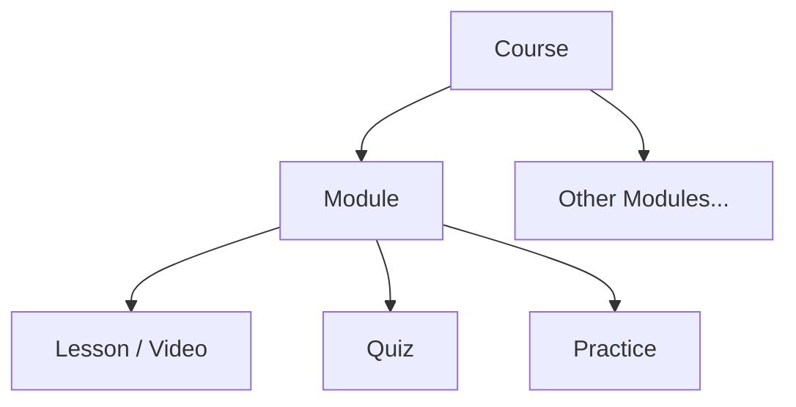

# Video Engine

## Concept

### Underlying Idea
**Web BRI + YouTube = Video Engine**

### Principle
* Course is designed first.
* Videos are recorded to fill the syllabus.
* Long-form YouTube videos become structured lessons on the BRI website.

## Platform Architecture

### The Funnel
1. **YouTube** (Discovery)
   * Shorts → Longform
2. **Website** (Learning System)
   * Website Course → Quiz → Practice → Paid Program

### Content Pipeline
* **1 Long-form Video** → **10 Shorts**
* Each short links to the course page (e.g., `rumahilmiah.org/persen`).

## Video Player

### Technology
* **YouTube IFrame Player API**
* Videos are embedded using the YouTube iframe player.

### Player Responsibilities
* Play YouTube video.
* Track watch progress.
* Save progress to user account.
* Resume playback.
* Link back to course page.

### Progress Tracking
Using the API:
* `player.getCurrentTime()`
* `player.getDuration()`

**Progress Calculation:**
```javascript
progress = currentTime / duration
```
**Update Interval:** Every 5–10 seconds.

## Course System

### Course Structure


**Example:**
* **Course:** Persen
  * **Module 1:** Konsep Dasar
    * Lesson 1: Apa itu persen
    * Lesson 2: Persen ke pecahan
  * **Module 2:** Soal PTS

### Progress UI
* **Course progress:** 40%
* [✔] Lesson 1
* [✔] Lesson 2
* [▶] Lesson 3
* [ ] Lesson 4

**Progress Formula:**
```
course_progress = sum(lesson_progress) / lesson_count
```

### Lesson Locking
**Sequential learning:**
* Lesson 2 unlocks if Lesson 1 ≥ 80%
* Lesson 3 unlocks if Lesson 2 ≥ 80%

## Admin Panel

### Purpose
Manage course content effectively.

### Features
* Attach video via YouTube link.
* Extract video ID automatically.
* Convert to iframe player.
* Fetch video metadata automatically (Title, Duration, Thumbnail).
* Manage course ordering.
* Attach quiz or practice materials.

### Lesson Parameters
| Field | Source |
| :--- | :--- |
| `title` | Auto fetched |
| `duration` | Auto fetched |
| `thumbnail` | Auto fetched |
| `youtube_url` | Manual |
| `course_id` | Manual |
| `module_id` | Manual |
| `order_index` | Manual |
| `is_preview` | Manual |
| `quiz_url` | Manual |
| `practice_url` | Manual |

## Data Model

### `courses`
* `id`
* `title`
* `description`

### `lessons`
* `id`
* `course_id`
* `title`
* `youtube_video_id`
* `index`
* `quiz_url`
* `practice_url`
* `duration`

### `user_lesson_progress`
* `user_id`
* `lesson_id`
* `progress_percent`
* `last_watched_second`
* `completed`
* `updated_at`

> Always store `last_watched_second`, not only percent. This allows resuming playback: `player.seekTo(last_watched_second)`.

## Team Responsibilities
* **Aaron:** Produce course modules.
* **Ben:** Produce longform videos + shorts distribution.


## Things to Take Note Of

- Progress Tracking Algorithm (Anti Cheat)
